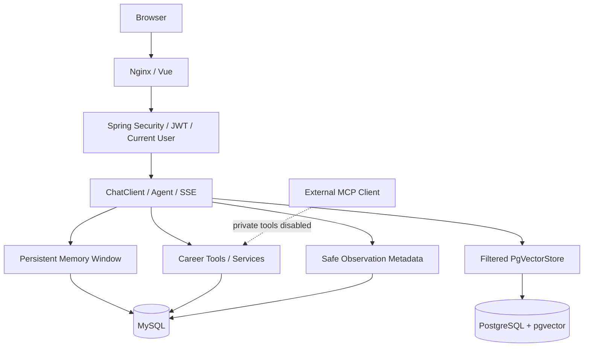

# CareerPilot AI

An AI-powered career assistant built with Spring Boot, Spring AI, Vue, MySQL and PostgreSQL/pgvector.

面向求职场景的多用户工作台：整理个人资料、分析岗位、跟踪投递，并通过可追踪的流式对话使用自己的知识库。v1.0.0 已进入发布准备；尚未创建远程仓库、Tag 或 Release。

## Features

- **Multi-user AI Agent** — JWT/BCrypt，数据库查询绑定 Current User。
- **Persistent Chat Memory** — 会话创建、历史、重命名和删除；MySQL 完整可见历史，模型默认只加载最近 20 条。
- **Persistent RAG** — PDF/TXT/MD → 官方 Reader/Splitter → Embedding → PgVectorStore；数据库级 userId 过滤。
- **Tool Calling** — 简历、岗位分析、话术、岗位保存、投递查询和状态更新。
- **Streaming Chat** — SSE 增量回答、执行状态、run lifecycle 和 Stop；成功时只写一次完整 Assistant 消息。
- **Observability** — requestId/runId、TTFT、耗时、Memory/RAG/Tool/LLM Trace，供应商报告的 Usage 或 null。
- **MCP implementation** — 保留只读能力实现；多用户部署默认关闭私人工具，避免无身份访问。
- **Web workspace** — Dashboard、Chat、Knowledge、Jobs、Applications、Observability。
- **Docker + CI** — 双数据库持久化、Nginx 同源入口、构建与安全检查。

本地集成已使用真实 HTTP、MySQL、PostgreSQL/pgvector 和明确的测试模型验收。**真实 OpenAI Chat/Embedding/Streaming、真实 Token Usage 和供应商计算取消尚未验证。**

## Tech Stack

| Layer | Actual configuration |
| --- | --- |
| Backend | Java 21 · Spring Boot 4.0.8 · Spring AI 2.0.1 · MyBatis-Plus 3.5.17 |
| Frontend | Vue 3 · TypeScript · Vite 7 · Router · Pinia · Axios · Element Plus |
| Storage | MySQL 8.4 / PostgreSQL 16 + pgvector 0.8.6 |
| Deployment | Multi-stage Docker builds · Docker Compose · Nginx |
| Quality | JUnit/Mockito/H2 · vue-tsc · GitHub Actions · pre-public check |

## Quick Start

只需 Git、Docker 和 Docker Compose；无需安装宿主机 Java、Maven、Node 或数据库。

```bash
cp .env.example .env
# 填写数据库密码、至少 32 字节随机 JWT_SECRET 和真实 OPENAI_API_KEY
# 保持 MYSQL_DATABASE=career_pilot_ai

docker compose up -d --build
```

访问 http://127.0.0.1:8088/register，注册自己的用户。默认生产配置使用 `text-embedding-3-small` / 1536 维和配置的 Chat 模型，**不会自动 fallback 到测试模型**。服务器部署、HTTPS、备份、升级 SQL 和资源建议见 [Development & Deployment](docs/development.md)。

### Explicit Local Test Demo — no paid API key

仍需在 `.env` 配置随机 DB/JWT 密钥；使用独立项目避免混入生产向量：

```bash
docker compose --env-file .env -p career-pilot-local-demo -f docker-compose.yml -f docker-compose.local-test.yml up -d --build
```

访问 http://127.0.0.1:18088/register。页面标记 **LOCAL TEST MODE**。LocalTestEmbeddingModel 是关键词/hash fixture，LocalTestChatModel 是确定性流程 fixture；**不是语义 Embedding 或真实 LLM**。详见 [Local Test Models](docs/local-test-embedding.md) 和 [5-minute demo](docs/demo-guide.md)。不自动创建 Demo 登录账号或生产演示数据。

## Architecture



## Streaming Agent Request Flow

JWT → owned Conversation → commit USER → bounded Memory → filtered RAG → Tools/LLM → SSE deltas → commit complete ASSISTANT once → Observability.

`run.started`, `memory.loaded`, `rag.started/completed`, `tool.started/completed`, `llm.started`, `token`, `message.completed`, `run.completed/failed` 描述可观察步骤，不暴露 Chain-of-Thought。取消/失败保留 USER，丢弃不完整 ASSISTANT。同步 `/api/chat` 继续兼容。

## Data Architecture & Privacy

MySQL 保存 Users、Profile、Jobs、Applications、Conversations、Chat Messages、AI Runs 和 Observability。PostgreSQL 只负责 RAG 文本 Chunk/Metadata/Embedding，不迁移 MySQL 业务。

**Chat History 会保存用户可见聊天正文。Observability 不保存完整 Prompt/Response、Resume、RAG Chunk 或 Tool Result。** Trace 只包含时长、状态、计数和关联 ID；不保存隐藏推理。

两个数据库用独立 Volume 持久化。`docker compose down` 保留数据，`docker compose down -v` 删除数据，谨慎使用。新数据卷自动执行 schema；旧数据卷按 [升级说明](docs/development.md) 手动应用缺失迁移。旧 SimpleVectorStore 数据需要重新上传；切换 Embedding 模型也需要重新索引。

## Security

- BCrypt 密码；JWT HS256，12 小时过期；JWT_SECRET 来自环境变量。
- 只有注册、登录、基础 Health 公开；其他业务接口要求 JWT。
- SQL owner predicate、PgVectorStore metadata filter、Conversation/Run/Trace IDOR 防护。
- 每用户 Chat + Stream 共用 token bucket，默认 20 次/分钟；Upload 默认 5 次/分钟，配置见下表。
- 上传 10 MB 上限、扩展名/MIME/PDF 签名/UTF-8 校验，拒绝危险路径和控制字符文件名。
- Nginx 同源 API、nosniff、frame DENY、Referrer Policy、CSP；开发 CORS 只允许 localhost:5173。
- 日志保留 ID/状态/耗时，不输出秘密和个人正文；错误包含安全 message/status/requestId。
- Token 使用 localStorage，发生 XSS 时存在读取风险。退出登录仅清除客户端 Token，不撤销已签 JWT。
- 仅 Nginx 对外发布，默认 loopback；数据库/Backend 没有公开端口。生产必须配置 HTTPS、备份和服务器访问策略。
- 发布前运行 `python scripts/pre-public-check.py --workspace`；不要上传本地密钥、日志或私密文档。

这是一套明确边界的项目安全措施，不是企业级安全认证。

## Environment Variables

| Variable | Purpose / default | Required |
| --- | --- | --- |
| MYSQL_DATABASE / MYSQL_USER | Compose MySQL；数据库固定 career_pilot_ai | Yes |
| MYSQL_PASSWORD / MYSQL_ROOT_PASSWORD | 随机业务/管理员数据库密码 | Yes |
| PGVECTOR_DATABASE / PGVECTOR_USERNAME / PGVECTOR_PASSWORD | 独立向量数据库 | Yes |
| PGVECTOR_HOST / PGVECTOR_PORT | 本地 Backend 默认 localhost:5432；Compose 使用 service name | Local override |
| PGVECTOR_DIMENSIONS | 1536，必须与 Embedding 一致 | Default |
| OPENAI_API_KEY | 真实供应商密钥；本地测试 override 明确清空 | Production |
| OPENAI_MODEL / OPENAI_EMBEDDING_MODEL | gpt-5-mini / text-embedding-3-small | Default |
| JWT_SECRET | 随机 ≥32 UTF-8 bytes | Yes |
| SPRING_PROFILES_ACTIVE | prod；本地 override 显式增加测试 profile | Default |
| CHAT_MEMORY_MAX_MESSAGES | 默认 20，模型上下文窗口 | Default |
| AI_CHAT_RATE_LIMIT / AI_UPLOAD_RATE_LIMIT | 每分钟 token refill；默认 20 / 5 | Default |
| WEB_HOST / WEB_PORT | 127.0.0.1 / 8088；公网部署可配置 0.0.0.0 / 80 | Default |
| DB_URL / DB_USERNAME / DB_PASSWORD | 本地进程 MySQL；Compose 从 MYSQL_* 映射 | Local |
| PGVECTOR_INITIALIZE_SCHEMA / PGVECTOR_VALIDATE_SCHEMA | 初始化/校验，默认 true | Default |
| LOCAL_TEST_WEB_PORT / LOCAL_TEST_STREAM_DELAY_MS | 仅测试 override，18088 / 100 ms | Local test |
| LOCAL_TEST_EMBEDDING_ENABLED | 仅显式测试 profile 的第二道开关 | Local test |
| SERVER_ADDRESS | 本地 127.0.0.1；Compose 0.0.0.0 内部网络 | Default |
| VITE_API_BASE_URL / VITE_PROXY_TARGET | 前端默认相对路径；本地 Vite 代理 | Local frontend |

不要把 secret 加入 VITE_*：它们会进入浏览器 bundle。

## API

主要接口：[完整 HTTP 表与安全示例](docs/api.md)。包括 Auth、Profile、Conversations、Chat/Stream/Cancel、Knowledge、Jobs、Applications、Observability 和 Health。没有 OpenAPI/Swagger 端点；MCP 不作为公开生产 HTTP API。

## Local Development / CI

[开发和验证命令](docs/development.md) · [CI architecture / branch protection](docs/ci.md)。构建命令：`mvn -B -ntp clean test`、`mvn -B -ntp clean package`、前端 `npm ci && npm run build`。普通测试不依赖真实模型 Key 或数据库。

GitHub workflow 准备了只读权限、Maven/npm 缓存、构建 Artifact 和 Docker Build；尚未上传 GitHub，**远程 Actions 未验证**，Branch Protection 需用户配置。无自动部署/GHCR 发布/自动合并。

## Screenshots & Demo

[Dashboard](docs/screenshots/dashboard.png) · [Streaming Chat](docs/screenshots/chat.png) · [Knowledge](docs/screenshots/knowledge.png) · [Observability](docs/screenshots/observability.png) — 实际本地测试浏览器截图，非真实模型质量演示。

目录 [docs/screenshots](docs/screenshots/README.md) 接收真实 Dashboard、Streaming Chat、Knowledge、Observability 截图；不生成假界面。[演示指南](docs/demo-guide.md) · [架构决策](docs/architecture.md) · [Changelog](CHANGELOG.md)。

## Project Structure

```text
src/main/java/com/careerpilot/  # auth/services/agent/conversation/stream/RAG/observability
src/test/                     # mocked, security and persistence tests
frontend/                     # Vue UI and Nginx production image
sql/                          # full schema and ordered migration scripts
scripts/                      # read-only checks and explicit local acceptance
docs/                         # architecture/development/demo/evidence
.github/                      # CI, weekly Dependabot and contribution templates
```

## Known Limitations

- Real OpenAI Chat / Embedding / Streaming integration not validated.
- Real provider Token Usage and provider-side cancellation not verified.
- Streaming run registry and rate limiter are single-backend-instance; budgets reset on restart. No distributed login rate limiting.
- No resumable SSE, refresh/reconnect uses committed message history.
- RAG production-scale latency/recall benchmark not completed; HNSW with metadata filtering needs further measurement.
- Local Test Embedding is not semantic embedding; synthetic vectors must stay separate from real embeddings.
- Jobs/Applications APIs expose latest 200 records; related Dashboard counts are bounded-list counts. Deep paging/large histories need further work.
- Observation data is not automatically cleaned up. Configure an operational retention/backup process; cost estimation is not implemented.
- No refresh tokens, token revocation, account recovery, email verification, RBAC or security certification.
- Standard Nginx image uses root master and non-root workers; backend is UID 10001.
- No selected License yet. Decide licensing before inviting third-party reuse.

Stage 17 prepares the project for publication; it does not upload GitHub, configure remote Settings or create a release.
