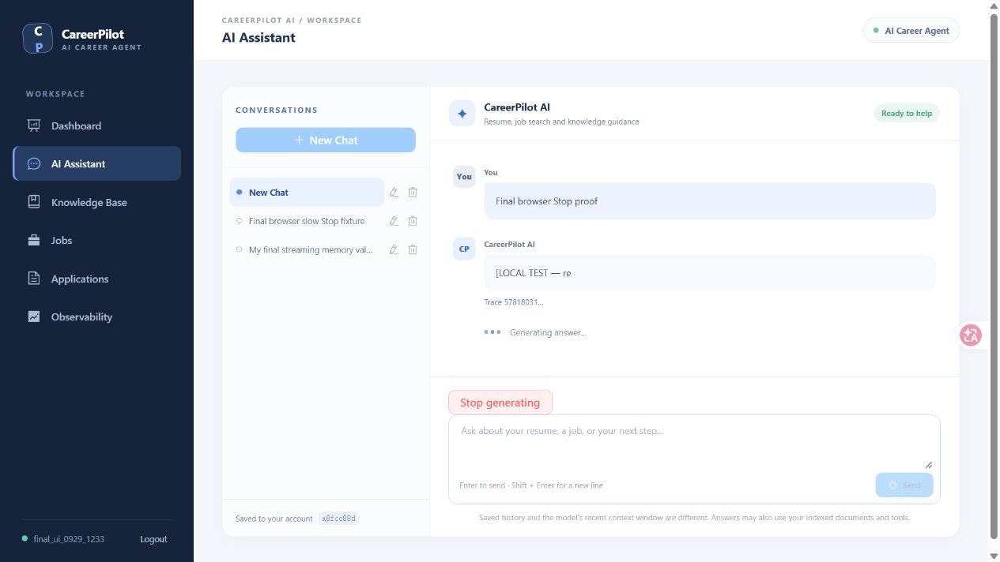
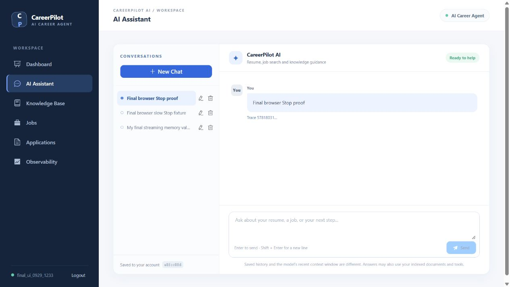
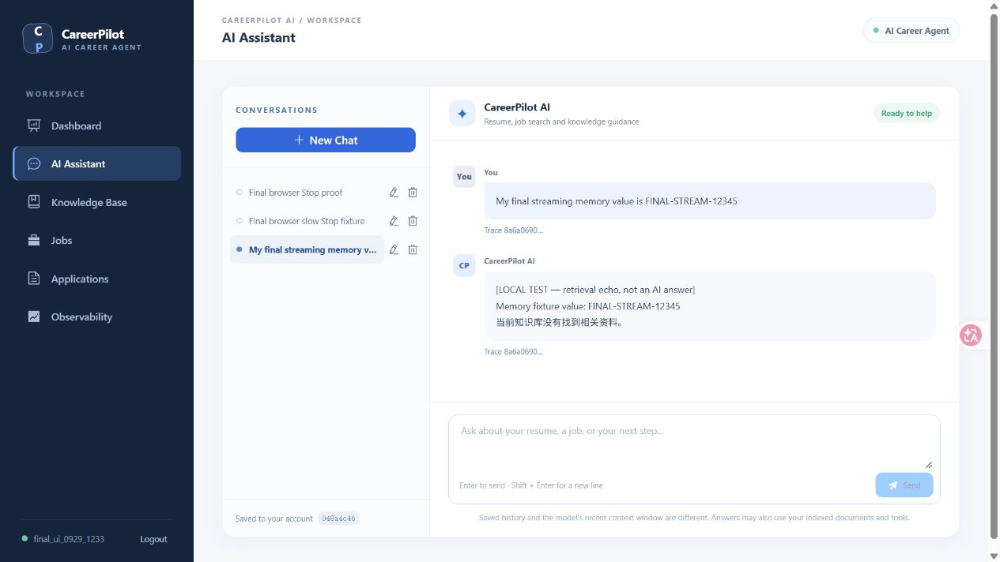

# 第十六阶段最终封版验收报告

2026-09-29，在当前代码上完成隔离 Docker 项目 `career-pilot-rag-acceptance` 的本地集成验收。真实入口为 `http://127.0.0.1:18088`。MySQL、PostgreSQL/pgvector、HTTP、Nginx、SSE 和浏览器均实际运行；模型使用显式 `local-test-embedding` Profile，不能视为真实 OpenAI 验证。未执行 `down -v` 或删除任何数据卷。

1. **Docker 最终状态：通过。** Docker Engine 29.8.0、Compose v5.5.1 可用。实际执行隔离项目的 `config --quiet`、`build`、`up -d`、`ps`。mysql、postgres-vector、backend healthy，frontend running。最终部署恢复默认测试流延迟 100ms。
2. **Health：通过。** 经 Nginx `/api/health` 返回 `{"status":"UP","application":"career-pilot-ai","database":"UP","vectorDatabase":"UP"}`。现有 application 字段是应用名称，总体状态由 status 表达。
3. **最新 SSE 全链路：通过。** 经 Nginx 使用带 Origin 和 JWT 的真实 POST 请求，确认 `run.started → memory.loaded → llm.started → token → message.completed → run.completed`，同时保留 RAG 事件。已完成两用户、本地工具、失败及取消验收。
4. **浏览器联调：通过。** 实际完成注册、退出后登录、会话列表、新建、发送、Thinking/Generating 状态、实时部分文本、Stop、刷新与历史恢复。验收发现并修复认证 computed 的响应式依赖短路问题；仅调整判断顺序，没有新增业务功能。
5. **Origin/CORS：通过。** 最新 Host 端口和 Forwarded 配置已实际部署。成功登录后的应用浏览器错误记录为 0，没有发现 CORS、401、Origin、Authorization 或 SSE 解析错误。浏览器扩展自身的错误没有计入应用错误。计划中的容器重建期间出现过连接中断，服务恢复后重新执行验证通过。
6. **Nginx buffering：通过。** 使用容器内 `nginx -T` 确认 `proxy_buffering off`、`proxy_cache off` 和 Host 端口保留。一次本地测试记录：首个 SSE 事件 47ms、首个 token 157ms、最后 token 1360ms；仅为本地开发数据。
7. **token 逐步到达：通过。** 上述请求有 13 个文本块，首尾间隔 1203ms；浏览器也实际显示了部分回答和 Generating 状态，没有只在末尾一次性显示。
8. **Stop：通过。** 浏览器采用 1000ms/块的本地测试流，收到部分文本后点击 Stop。真实数据库状态 CANCELLED、输出块数 2、USER=1、ASSISTANT=0；刷新后会话正常。HTTP 取消用例确认没有 `message.completed`。
9. **Cancel IDOR：通过。** B 取消 A 的 run，实际 HTTP 返回 404。
10. **Memory + Streaming：通过。** A 输入指定的 `My final streaming memory value is FINAL-STREAM-12345` 后，再次询问返回该值；B 的测试值不会串入 A。仅补齐本地夹具对 optional final 句式的识别，回归断言先失败、修复后通过；生产模型与 Memory 流程未改。
11. **Backend restart 持久化：通过。** 实际 `restart backend`、等待恢复、重新登录、加载原历史并再次提问，仍返回 FINAL-STREAM-12345。
12. **RAG + Streaming：通过。** 上传 FINAL-RAG-VALUE-67890 测试资料后，真实 pgvector 查询取回并流式输出；Trace 同时包含 MEMORY、RAG_SEARCH、LLM。该 RAG 样本 topK=4、chunkCount=1、耗时 13ms；对应用户 PostgreSQL vector_store 真实存在 1 条向量。
13. **Tool + Streaming：通过。** 本地工具夹具经官方 Advisor 实际调用 getResume；事件为 `tool.started → tool.completed → token`。SSE 不发送完整 Tool Result。
14. **ai_run 状态：通过。** 最终 HTTP A/B 和浏览器三个测试用户合计 14 次运行：COMPLETED=11、CANCELLED=2、FAILED=1。失败来自本地可控失败夹具，不是假造的状态。
15. **Message 持久化：通过。** 三个测试用户有 9 个会话、14 条 USER/SENT、11 条 ASSISTANT/COMPLETED。每次成功请求完整回答恰好写入一次，重复 Assistant 请求数为 0，失败或取消没有 Assistant。成功回答等于 SSE 文本块拼接结果。
16. **Observability：通过。** 数据库实际记录 SUCCESS=11、CANCELLED=2、FAILED=1；MEMORY=14、RAG_SEARCH=14、LLM=14、TOOL_CALL=1，包含 TTFT、duration、chunkCount 等安全指标。LOCAL_TEST Token 为 null；不写入隐藏推理或 Chunk 正文。
17. **Compose down/up：通过。** 实际执行不带 `-v` 的 `down` 后 `up -d`，重新登录并确认原会话、消息及 FINAL-RAG-VALUE-67890 向量资料仍存在，Memory 和 RAG 查询成功。
18. **Backend 测试：通过。** 本次执行 `mvn -B -ntp clean test`：83 个测试、失败 0、错误 0、跳过 0，BUILD SUCCESS（12:34:19 +08:00）；`mvn -B -ntp clean package`：同样 83 个测试并 BUILD SUCCESS（12:34:51 +08:00）。Docker 构建亦运行了 83 个测试成功。未删除测试或跳过检查。
19. **Frontend Build：通过。** 实际 `npm ci` 安装 109 个包成功；`npm run build` 的 vue-tsc 类型检查与 Vite 构建成功（10.92s）。仍有大于 500kB 的包体积警告。最终 frontend 镜像构建成功。
20. **仍未验证内容：** 真实 OpenAI Streaming：未验证；真实 OpenAI TTFT：未验证；真实供应商 Cancel：未验证；真实 Token Usage：未验证。没有真实 API Key，所有模型结果为本地集成测试。远程 GitHub Actions 未执行；本地 CI 配置检查通过。供应商计费停止、分布式 Run 和断点续传不在本次验收范围。

## Evidence

- [HTTP/SSE、重启和 down/up](streaming-final-http-results.json)
- [浏览器联调](streaming-final-browser-results.json)
- [最终容器及 Health](streaming-final-deployment-results.json)
- [MySQL 实际统计](streaming-final-database-results.json)
- [验证汇总](streaming-verification-summary.json)

## Commands

所有 Compose 操作使用以下参数，以隔离已有项目：

```powershell
docker compose --env-file .env.rag-acceptance -p career-pilot-rag-acceptance -f docker-compose.yml -f docker-compose.local-test.yml config --quiet
docker compose --env-file .env.rag-acceptance -p career-pilot-rag-acceptance -f docker-compose.yml -f docker-compose.local-test.yml build
docker compose --env-file .env.rag-acceptance -p career-pilot-rag-acceptance -f docker-compose.yml -f docker-compose.local-test.yml up -d
docker compose --env-file .env.rag-acceptance -p career-pilot-rag-acceptance -f docker-compose.yml -f docker-compose.local-test.yml ps
python scripts/verify-streaming.py
python scripts/verify-streaming-final.py
mvn -B -ntp clean test
mvn -B -ntp clean package
cd frontend
npm ci
npm run build
```

`.env.rag-acceptance` 和 `.env.streaming-final-users.json` 是被 Git 忽略的本地测试凭据，不能提交；证据文件不含 JWT 或密码。

## Real Browser Screenshots





本阶段停止，不开发第十七阶段。
